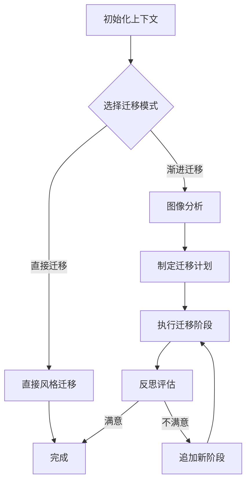

# 风格迁移代理系统 (Style Transfer Agent)

一个基于LangGraph和Google Gemini 2.5的智能风格迁移系统，支持多阶段艺术风格转换和图像生成。

## 📋 项目简介

这是一个先进的风格迁移代理系统，能够智能地分析内容图像和风格图像，通过多阶段渐进式处理，将风格图像的艺术特征（如颜色、纹理、笔触风格等）迁移到内容图像上。系统采用现代化的AI技术栈，包括：

- **LangGraph**: 用于构建多代理工作流
- **Google Gemini 2.5 Flash**: 用于图像分析、规划和生成
- **MCP (Model Context Protocol)**: 用于扩展AI模型能力
- **结构化输出**: 使用Pydantic模型确保输出格式一致性

## ✨ 主要特性

- 🎨 **智能图像分析**: 多维度分析风格图像的艺术特征
- 📋 **自动规划生成**: 基于分析结果制定多阶段迁移计划
- 🔄 **渐进式迁移**: 支持多阶段风格迁移，每阶段聚焦不同艺术元素
- 🔍 **自我反思机制**: 自动评估生成结果并决定是否需要进一步优化
- 🚀 **直接迁移模式**: 支持快速单步风格迁移
- 📊 **结构化输出**: 生成详细的分析报告和迁移计划
- 🔧 **可扩展架构**: 支持通过MCP服务器扩展功能

## 🏗️ 系统架构

### 核心组件

1. **图像分析代理 (Describe Agent)**: 分析内容图像和风格图像的多维度特征
2. **规划代理 (Plan Agent)**: 制定多阶段风格迁移计划
3. **执行代理 (Execute Agent)**: 执行具体的图像生成任务
4. **反思代理 (Reflect Agent)**: 评估生成结果并决定优化方向

### 工作流程



## 🚀 快速开始

### 环境要求

- Python 3.8+
- Google Cloud Project (用于Gemini API)
- 必需的Python包 (详见依赖安装)

### 安装步骤

1. **克隆项目**
   ```bash
   git clone <repository-url>
   cd style-transfer-agent
   ```

2. **创建虚拟环境**
   ```bash
   python -m venv venv
   source venv/bin/activate  # Linux/Mac
   # 或
   venv\Scripts\activate  # Windows
   ```

3. **安装依赖**
   ```bash
   pip install -r requirements.txt
   ```

   主要依赖包包括：
   - `langgraph`: 构建代理工作流
   - `langchain-google-vertexai`: Google Gemini集成
   - `google-generativeai`: Google生成式AI客户端
   - `pillow`: 图像处理
   - `pydantic`: 数据验证
   - `pyyaml`: 配置文件处理
   - `python-dotenv`: 环境变量管理

4. **配置环境变量**

   创建 `.env` 文件并配置以下变量：

   ```env
   # Google Cloud配置
   GOOGLE_API_KEY=your_google_api_key
   GOOGLE_PROJECT_ID=your_project_id

   # 可选：生产环境标识
   PRODUCTION=false

   # 可选：高中图书馆MCP服务器
   HIGH_SCHOOL_LIBRARY_URL=your_mcp_server_url
   ```

5. **Google Cloud认证**

   确保已通过Google Cloud认证：
   ```bash
   gcloud auth application-default login
   ```

   或使用服务账号密钥文件（`private.json`）。

### 基本用法

#### 命令行运行

```bash
# 使用默认图像进行风格迁移
python run_agent.py

# 指定自定义图像
python run_agent.py \
  --style_image_path styles/style.png \
  --content_image_path contents/content.png \
  --prompt "将艺术风格迁移到内容图像上"

# 直接迁移模式（跳过多阶段过程）
python run_agent.py --directly

# 指定结果目录
python run_agent.py --result_dir custom_results
```

#### Python API使用

```python
import asyncio
from src.agent.graph import graph
from src.agent.schema import State

async def run_style_transfer():
    # 配置初始状态
    initial_state: State = {
        "style_image_path": "styles/style.png",
        "content_image_path": "contents/content.png",
        "project_dir": "result/custom_run",
        "generated_images_map": {},
        "user_prompt": "将风格迁移到内容图像上",
        "image_analysis": None,
        "style_transfer_plan": None,
        "directly": False
    }

    # 编译并运行图
    app = graph.compile()
    final_state = await app.ainvoke(initial_state)

    print("生成的文件:")
    for tag, path in final_state['generated_images_map'].items():
        print(f"  - {tag}: {path}")

# 运行
asyncio.run(run_style_transfer())
```

## 📁 项目结构

```
/Users/wangshiwen/Desktop/workspace/style-transfer-agent/
├── src/                          # 源代码
│   ├── agent/                    # 核心代理逻辑
│   │   ├── graph.py              # LangGraph工作流定义
│   │   ├── schema.py             # 数据模型定义
│   │   └── drawing_processes.txt # 绘画过程示例
│   ├── config/                   # 配置管理
│   │   ├── manager.py            # 配置管理器
│   │   └── model.py              # 模型配置定义
│   └── utils/                    # 工具函数
├── styles/                       # 风格图像样本
├── contents/                     # 内容图像样本
├── data/                         # 数据集
│   ├── content/                  # 内容图像数据集
│   └── style/                    # 风格图像数据集
├── result/                       # 生成结果输出
├── agent_output/                 # 代理运行输出
├── config.yaml                   # 主配置文件
├── run_agent.py                  # 命令行入口
└── README.md                     # 项目文档
```

## ⚙️ 配置说明

### 主配置文件 (config.yaml)

```yaml
# MCP服务器配置
mcp_servers:
  highschool-library:
    transport: sse
    url: ${HIGH_SCHOOL_LIBRARY_URL}
    enabled_tools: [retrieve_relevant_document]

# 默认模型配置
default_model:
  model_provider: google_vertexai
  model: gemini-2.5-flash
  api_key: ${GOOGLE_API_KEY}
  temperature: 0.7

# 代理配置
agents:
  core:
    describe_agent:      # 图像分析代理
      model:
        model_provider: google_vertexai
        model: gemini-2.5-flash
        temperature: 0.7
      prompt: |
        您是一位专业的艺术评论家和风格分析师...

    plan_agent:          # 迁移规划代理
      model:
        model_provider: google_vertexai
        model: gemini-2.5-flash
        temperature: 0.7
      prompt: |
        您是一位艺术和风格迁移专家...

    reflect_agent:       # 反思评估代理
      model:
        model_provider: google_vertexai
        model: gemini-2.5-flash
        temperature: 0.2
      prompt: |
        您是一位专业的艺术评论家...
```

### 环境变量

| 变量名 | 描述 | 示例 |
|--------|------|------|
| `GOOGLE_API_KEY` | Google API密钥 | `AIzaSy...` |
| `GOOGLE_PROJECT_ID` | Google Cloud项目ID | `my-project-123` |
| `PRODUCTION` | 生产环境标识 | `true` / `false` |
| `HIGH_SCHOOL_LIBRARY_URL` | MCP服务器URL | `http://localhost:8001` |

## 📊 使用示例

### 示例1: 基本风格迁移

```bash
python run_agent.py \
  --style_image_path styles/style.png \
  --content_image_path contents/content.png \
  --prompt "将艺术风格迁移到内容图像上"
```

生成的多阶段过程：
1. **轮廓描绘**: 创建精致的黑色轮廓线条，定义人物形象结构
2. **基础色彩**: 应用鲜艳丰富的宝石色调色彩填充
3. **图案装饰**: 添加复杂的花卉、几何和点状装饰图案

### 示例2: 直接迁移模式

```bash
python run_agent.py \
  --directly \
  --style_image_path styles/style.png \
  --content_image_path contents/content.png
```

快速单步迁移，适合快速原型验证。

## 🎯 效果展示


系统成功将艺术风格智能迁移到内容图像，展示了多阶段渐进式处理的效果。

## 🔍 输出结果

### 生成文件结构

每个运行会创建独立的结果目录：

```
result/
└── {style_image_name}/
    ├── style_image.png           # 复制的风格图像
    ├── content_image.png         # 复制的内容图像
    ├── image_analysis.json       # 多维度图像分析结果
    ├── style_transfer_plan.json  # 多阶段迁移计划
    ├── initial_sketch_YYYYMMDD_HHMMSS.png    # 初始草图
    ├── refined_lines_YYYYMMDD_HHMMSS.png     # 精炼线条
    ├── final_stylized_image_YYYYMMDD_HHMMSS.png  # 最终结果
    └── direct_stylized_image_YYYYMMDD_HHMMSS.png # 直接迁移结果
```

### 分析报告示例

```json
{
  "style_image_analysis": {
    "color_palette": "柔和的 pastel 色彩，以蓝色和绿色为主，营造宁静氛围",
    "brushwork_and_texture": "精细的笔触，注重细节描绘，带有印象派风格",
    "lighting_and_shadow": "柔和的光影，强调自然光效果",
    "artistic_style_and_genre": "印象主义风景画",
    "key_elements_and_motifs": "自然景观，注重光影和色彩和谐"
  },
  "content_image_description": "一幅宁静的湖边风景，树木环绕，远山隐约可见",
  "corresponding_regions_description": "天空区域对应风格图像的天空，水面区域对应倒影部分"
}
```

## 🛠️ 开发指南

### 添加新的代理

1. 在 `config.yaml` 中定义代理配置
2. 在 `src/agent/` 目录下创建代理逻辑
3. 在 `graph.py` 中集成到工作流中

### 自定义迁移计划

可以通过修改 `drawing_processes.txt` 文件来自定义绘画过程模板。

### 调试技巧

- 使用 `--directly` 标志进行快速测试
- 检查 `result/{run_id}/` 目录下的JSON文件
- 查看控制台输出的详细日志信息

## 📈 性能优化

- **批处理**: 支持批量处理多个风格/内容图像组合
- **缓存机制**: 避免重复的图像分析计算
- **并行处理**: 支持多阶段并行执行（实验性功能）

## 🤝 贡献指南

欢迎提交Issue和Pull Request！请确保：

1. 代码符合项目风格指南
2. 添加适当的测试用例
3. 更新相关文档
4. 通过所有现有测试

## 📄 许可证

本项目采用MIT许可证 - 详见LICENSE文件

## 🙏 致谢

- [LangGraph](https://github.com/langchain-ai/langgraph) - 优秀的代理工作流框架
- [Google Gemini](https://ai.google.dev/) - 强大的多模态AI模型
- [LangChain](https://github.com/langchain-ai/langchain) - 出色的LLM集成工具

---

如有问题或建议，请提交Issue或联系项目维护者。
